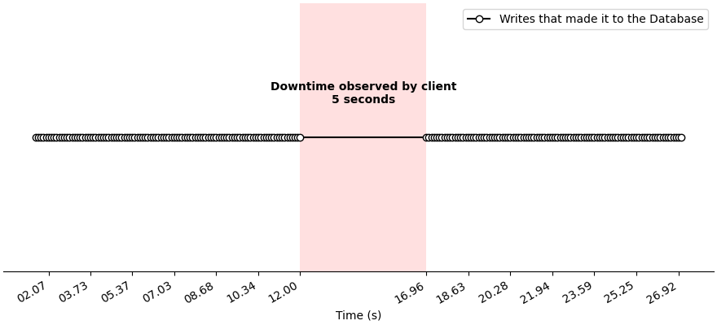
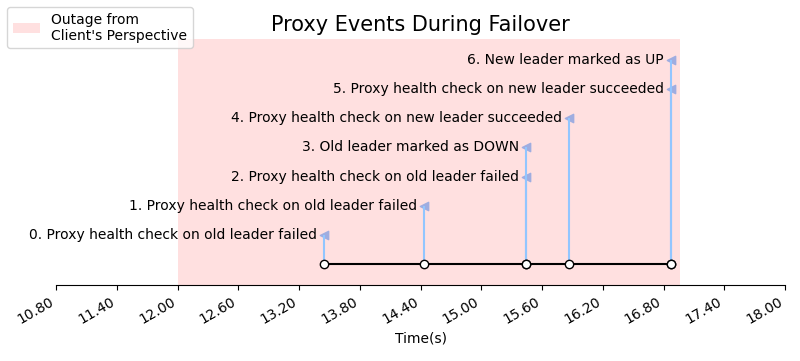
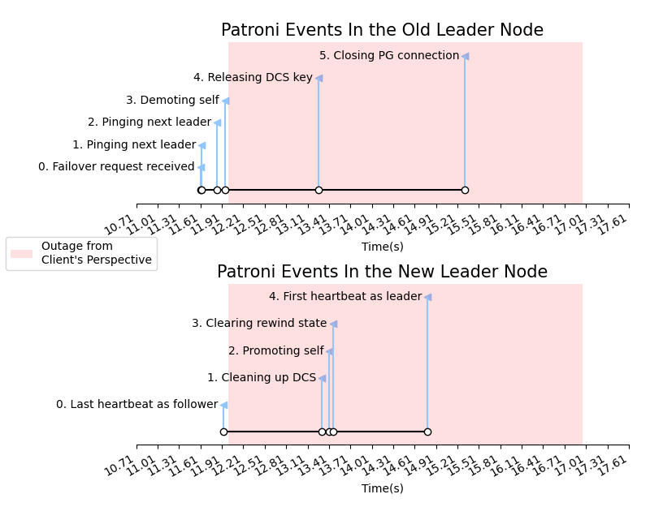
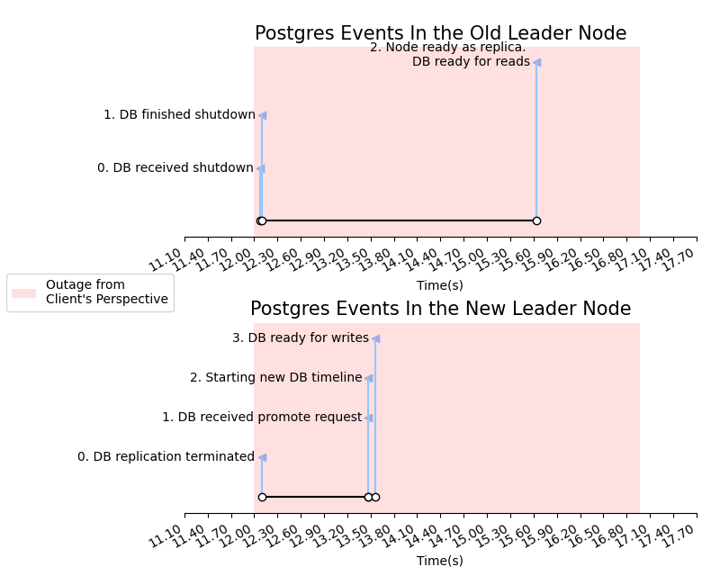

# Introduction

Modern users expect their apps and data to be accessible, _always_. Not just most of the time. Not just when there isn't maintence. __100% of the time__. That's what _highly available (HA)_ systems provide.

Okay, fine, true 100% uptime simply isn't possible. After all, the probability of a meteor destroying the planet tomorrow (and all your servers) is greater than 0%. But with thoughtful system design, we can get surprisingly close to that magic 100% guarantee.

In today's article, we'll explore how HA Databases are implemented in practice, with a special focus on understanding the mechanisms that allow HA databases to survive a handful of crashed nodes. By the end of this article, you'll understand what a failover is and get a peek under the hood of how failovers work in practice using Postgres and Patroni.

## State of the Art

Most modern systems implement shared-nothing high availability using a [primary replica](https://www.cs.cornell.edu/fbs/publications/DSbook.c8.pdf) model, where one node (the _primary_) is responsible for all write connections. The _replicas_ receive updates from the primary and maintain their own copy of the databse. Some replicas are _syncronous_, meaning that the primary must make sure that they have commited all changes before telling the client that the write has persisted. Other replicas are _asyncronous_, and the primary may continue serving client write requests before receiving confirmation. Syncronous replicas are useful for ensuring there is no data loss, but lead to worse write performance.

In the event that the primary goes down, some kind of [consensus algorithm](https://en.wikipedia.org/wiki/Consensus_(computer_science)) is used amongst the remaining replicas to decide who will become the next primary. A [proxy](https://en.wikipedia.org/wiki/Proxy_server) (or even proxies) is used to ensure that the from client's perspective, it appears as though there is only a single, consistent node, with brief spurts of downtime while the system is transitioning primaries.

State of the art systems have many additional optimizations to improve performance, including allowing read-only connections to replicas to reduce the load generated by reads on the primary, and tiering replicas to minimize the number of replicas the primary must communicate with.

## Failover

Regardless of the setup, all HA database systems have to deal with _failover_. Failover is the process where a replica (or collection of replicas) automatically detect the failure of the primary and participate in the election of a new primary. _Failover time_ is the amount of time, from the end-user's perspective, where the database cluster cannot accept new traffic as this transition is happening. 

In today's article, we're going to dive deep into failover and answer the question:

> What are the steps that happen during failover in a modern HA system, and how much time do they each take?

# High Availability in Practice

## Setup and Environment

If you'd like to follow along yourself, you can follow the [detailed setup descriptions](https://github.com/mfpekala-nutanix/patroni-experiments/blob/main/docs/setup.md) from the associated project github. At a high level, here are the tools we're using:

- 4 VMs provided through [Nutanix Prism](https://www.nutanix.com/products/prism) running CentOS 7.6.
- [Postgres 15](https://www.postgresql.org/) as the underlying database.
- [Patroni](https://patroni.readthedocs.io/en/latest/) (version 3.0.1) for templating and managing the Postgres nodes in the cluster.
- [HAProxy](https://www.haproxy.org/) (version 2.8.0) to expose a single endpoint for DB connections even as the roles of the individual nodes change.
- [Python Flask](https://flask.palletsprojects.com/en/2.3.x/) (version 2.3.1) to allow simple API-based communication through your local machine.

This setup is a simplified version of what is provided to you out of the box from the [Nutanix NDB](https://www.nutanix.dev/api_references/ndb/#/8girlyu0d2t1d-nutanix-ndb-api-v0-9) Postgres HA provisioning service.

Unfamiliar with any of the above? Don't worry, you'll still be able to follow along and learn about failover in practice.

## System Architecture

Before going any further, let's take a moment to understand how the nodes in our system are set up.

### Nutanix Cloud

We have a total of four nodes deployed in the Nutanix Cloud.

***Database Nodes***

There are three databse nodes. One primary and two replicas. Each node is running three services:

- _Patroni_ - You can think of Patroni as a Postgres manager. It creates a Postgres instance on each node, and handles Postgres configuration so that the replicas use Postgres's built in [write-ahead-log (WAL)](https://www.postgresql.org/docs/current/wal-intro.html) and replication features to follow updates from the primary. Patroni also exposes an API so that we can monitor the health of each DB instance.
- _Etcd_ - [Etcd](https://etcd.io/) is a distributed configuration store, which provides a reliable way for each node to read and update the state of the system. When a primary node goes down, and we need to elect a new primary, etcd ensures that everyone agrees on who the new primary is to avoid [split-brain](https://en.wikipedia.org/wiki/Split-brain_(computing)).
- _Python Flask_ - We use Flask to expose a very simple API on each node that allows us to more easily control it for the sake of experimentation. Through the flask API, we can do things like restart Patroni/etcd, reset data, and scrape logs.

***Proxy Node***

We also run one proxy node. Like the database nodes, the proxy node has a simple Flask API to facilitate remote control and monitoring. In addition, it runs HAProxy to regularly poll the health of the database nodes, and make sure client requests always get routed to the current primary. This allows each client to interact with the system as if there was a single node.

### Local Computer

Our local computer uses API requests to communicate with the cloud nodes and orchestrate the experiment. It has two main threads:

- A writing thread - This thread simply connects to the proxy and attempts to write 100KB of data to the database every tenth of a second.
- A failover thread - This thread triggers a failover in the primary after a certain amount of time, and then ends the experiment after a new primary is chosen and healthy.

## Experiment 

Our experiment is quite straightforward given the above setup. We simulate a business application generating data through the writing thread on our local computer. By triggering a failover through the Patroni API, we simulate what would happen during a planned outage. Then, we monitor the system until it is healthy, and can reason about how much data was lost 

## Results

We'll explore the results of this experiment from a top-down perspective. That is, we'll start with what was observed by the end-user, and gradually peek deeper and deeper into the technical stack, uncovering the specific steps that contributed to the downtime.

### Client Perspective

The client wants to be writing to the database constantly. However, as is shown by the red region in the above graph, there are roughly 5 seconds during the failover where the client's writes are not persisted. This downtime also causes existing database connections to be dropped. Let's see what's happening under the hood to cause this downtime, starting with the proxy.

### Proxy's Perspective

Client's don't directly connect to databases. Instead, they connect through the proxy, who is in charge of keeping track of who the current leader is and routing connections to them. When a failover happens, the proxy must do a few things in a specific order. 

First, the proxy must realize that the old leader is "DOWN", or no longer the leader. It does this by issuing regular health checks to every node, and pronouncing the leader DOWN when it fails to respond to three consecutive health checks. _Why not call the leader DOWN after only one failed health check?_ Because systems and networks aren't perfect, and it's possible that every now and then a healthy node may fail a health check. By waiting to call a node DOWN until multiple health checks fail, we greatly reduce the chances of calling the system down and interrupting service erroneously.

Once the proxy calls the old leader DOWN, it begins looking for the next leader. Note that the proxy does not participate in the consensus algorithm to pick the next leader, but simply observes the results by regularly asking each node if they are the leader. When a node responds "yes, I am the leader" that constitutes a successful health check. Similar to earlier, a node must pass two consecutive health checks in order to be marked UP and start receiving write traffic.

This process is shown in detail below by graphing the logs from our proxy node.

We observe a few important things about failover from this graph:

- From the first moment of client-observed downtime, it takes around 3.5 seconds for the old leader to be marked as DOWN by the proxy. This means that during this time, client writes are failing because they are being directed to the old leader, who rejects write traffic after restarting it's copy of the database.
- After marking the older leader as down, it only takes roughly 1.5 seconds for the new leader to be marked as UP. Shortly after the new leader is marked as UP (~0.05 seconds) the client-perceived downtime stops and writes once again start succeeding.
- At the beginning of the downtime, there is a signficant amount of time (~1.5 seconds) before the old leader fails it's first health check.

This tells us a lot about what happens during failover, but there's still more we'd like to know. For instance, _what happens in the old leader before it fails it's first health check?_ Additionally, _what must happen in the new leader before it passes it's first health check?_ To answer these questions, we'll take a look at the Patroni and Postgres logs.

### Patroni's Perspective

Patroni is in charge of managing Postgres. Like the proxy, there are a few things it has to do when participating in the failover. It's worth mentioning that each node is running it's own copy of the Patroni service, and that the Patroni service on the old leader has different responsibilities than the Patroni service running on the new leader. 

__Events in the Old Leader__

We'll start by talking about the events that happen in the old leader node.

First, it pings the next leader to ensure that it is up and healthy. It does this twice to be more confident that the next leader will indeed be ready to accept traffic.

After that, it demotes itself, meaning it tells it's own running Postgres server to shut down. As part of this shutdown process, using built-in Postgres replication functionality, the old leader ensures that all syncronous replicas are sufficiently caught up. There is a configuration parameter in Patroni that says how much data loss is tolerable, and before shutdown all syncronous replicas must be within that much data of the current leader. 

Once demotion is complete, the old leader can release the leader key in the distributed configuration store (DCS). The DCS ensures that this leader key can only be held by one node at a time, so by releasing the DCS key the old leader is officially allowing another node to claim it and successfully call itself the leader.

__Events in the Old Leader__

Promotion events in the new leader begin once it claims the leader key in the DCS during the "Cleaning up DCS" step. Once it's claimed this key, it can successfully call itself the leader, and begins preparing to serve write traffic. If you compare the Patroni graph below to the proxy graph from the previous section, you'll notice that the time that the old leader starts failing health checks and the new leader starts passing health checks corresponds exactly with this transfer of the "leader" key in the DCS.

Before writes can succeed, the new leader must issue a promote request to it's own Postgres server, and clear it's rewind state. After that, every Patroni heartbeat will show the new leader as the leader. These events are shown in the below graph. Notice that the events of the new leader are shown on the top timeline, and the events of the old leader are on the bottom timeline.

With this log information, we've learned a few more things:

- After the failover request is received, the old leader can successfully serve write requests until it demotes its own postgres instance. This happens after it pings the next leader to ensure it is healthy.
- The first ~1 second of downtime comes from the fact that there is a gap between when the old leader begins to demote it's Postgres server (dropping connections) and when it releases the leader key in the DCS.
- The new leader needs around 1.5 seconds after claiming the leader key in DCS to issue it's first heartbeat as leader.

The last piece of the puzzle is to look at the underlying Postgres servers, and see when they are available for different kinds of traffic.

### Postgres's Perspective

Since Postgres is being managed by Patroni, most of the Postges events correspond directly with the Patroni events observed above. However, since the health status returned by Patroni corresponds to the Postgres database state, we can still learn useful things about timing during a failover by checking the Postgres logs, illustrated below.

A few things jump out at us:

- The act of shutting down the database is very fast, and corresponds with the beginning of the client-perceived outage.
- After the old leader restarts, it rejoins the cluster accepting read-only traffic after about 4 seconds.
- When the new leader receives the promote request, its Postgres server starts a new database timeline and then is ready to accept writes.

In a real application, database size and ingestion rate may be higher, which may inflate the amount of time taken to start/stop the underlying Postgres servers. However, in our experiment, we observe that the new leader is ready to accept writes over 3 seconds before the client-perceived outage ends. 

### Takeaway

This may seem strange. _If the new leader is ready to accept writes, why can't the client write?_ At the end of the day, it comes down to reliability. In order to reduce the failover time, we'd have to have the proxy, and the underlying Patroni service recognize the failure faster. This would involve more frequent pings, and reducing the number of pings required to call a node dead or alive. This not only increases the administrative load on the nodes in our system, but it also increases the odds that we accidentally call a node (or the system) DOWN when in reality it's up.

In some cases, we may care about having the absolute lowest failover time possible. Our experiments suggest that this number could be as low as 1-1.5 seconds, if we had the proxy and Patroni pinging constantly.

For every setup, there's plenty of room to tweak the configuration settings to see what works best.

## Future Work

The beauty of this set up, and Nutanix NDB provisioned HA database clusters in general, is that it's modular and easy to use. We can orchestrate complex experiments from our local computer without any issues.

Going forward, there's still much we can do to better understand the latency experienced by our users, including...

- Benchmark this system to find its limits when it comes to data ingestion, number of nodes, network latency/partitioning, etc.
- Implement some of the more advanced optimizations mentioned earlier including balancing read requests across replicas and tiering the network structure.

Thanks for reading!

