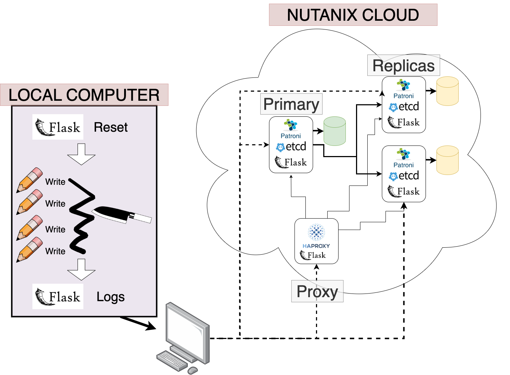
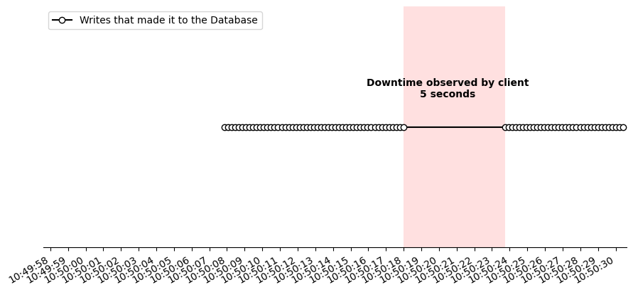
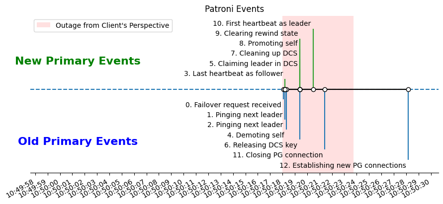
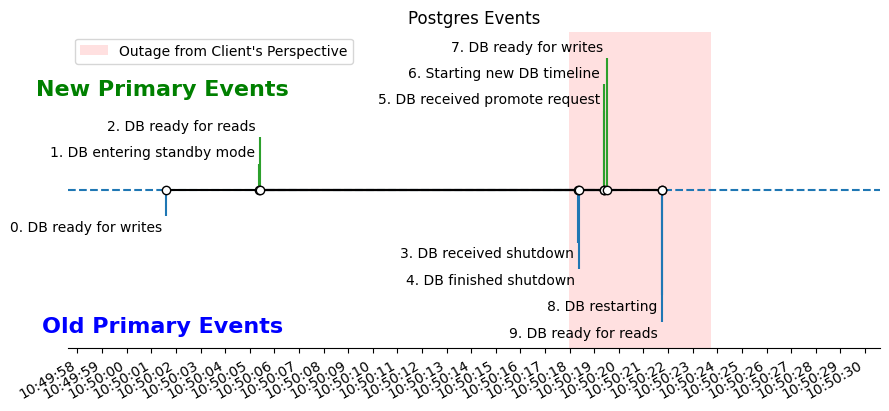

# Introduction

Modern users expect their apps and data to be accessible, _always_. Not just most of the time. Not just when there isn't maintence. __100% of the time__. That's what _highly available (HA)_ systems provide.

Okay, fine, true 100% uptime simply isn't possible. After all, the probability of a meteor destroying the planet tomorrow (and all your servers) is greater than 0%. But with thoughtful system design, we can get surprisingly close to that magic 100% guarantee.

In today's article, we'll explore how HA Databases are implemented in practice, with a special focus on understanding the mechanisms that allow HA databases to survive a handful of crashed nodes. By the end of this article, you'll understand what a _failover_ is, as well as see an example of latency breakdown in a real-world highly-available database using Postgres and Patroni. 

## State of the Art

Most modern systems implement high availability using a [_primary replica_](https://www.cs.cornell.edu/fbs/publications/DSbook.c8.pdf) model, where one node (the _primary_) processes all queries, and is responsible for sending these queries to the replicas. The replicas acknowledge receipt of the queries from the primary, and follow along with their own local copy of the database.

In the event that the primary goes down, some kind of [_consensus algorithm_](https://en.wikipedia.org/wiki/Consensus_(computer_science)) is used amongst the remaining replicas to decide who will become the next primary. A [_proxy_](https://en.wikipedia.org/wiki/Proxy_server) (or even proxies) is used to ensure that the from the client's perspective, it appears as though there is only a single, consistent node. (Although there may be a moment or two of downtime as a new primary is taking over.) Because each replica follows along with a local copy of the database, if/when they become primary, there is minimal lag before they are ready to accept new queries.    

State of the art systems have many additional optimizations to improve performance, including allowing read-only connections to replicas to reduce the load generated by reads on the primary, and tiering replicas to minimize the number of replicas the primary must communicate with.

## Failover

Regardless of the setup, all HA database systems have to deal with _failover_. Failover is the process where a replica (or collection of replicas) automatically detect the failure of the primary and promote a new primary. _Failover time_ is the amount of time, from the end-user's perspective, where the database cluster cannot accept new queries as this transition is happening. 

In today's article, we're going to dive deep into failover and hopefully answer the question:

> What are the steps that happen during failover in a modern HA system, and how much time do they each take?

# High Availability in Practice

## Setup and Environment

If you'd like to follow along yourself, you can follow the [detailed setup descriptions](https://github.com/mfpekala-nutanix/patroni-experiments/blob/main/docs/setup.md) from the associated project github. At a high level, here are the tools we're using:

- 4 VMs provided through [Nutanix Prism](https://www.nutanix.com/products/prism) running CentOS.
- [Postgres](https://www.postgresql.org/) as the underlying database.
- [Patroni](https://patroni.readthedocs.io/en/latest/) for templating and managing the Postgres nodes in the cluster.
- [HAProxy](https://www.haproxy.org/) to expose a single endpoint for DB connections even as the roles of the individual nodes change.
- [Flask](https://flask.palletsprojects.com/en/2.3.x/) to allow simple API-based communication through your local machine.

This setup is a simplified version of what is provided to you out of the box from the [Nutanix NDB](https://www.nutanix.dev/api_references/ndb/#/8girlyu0d2t1d-nutanix-ndb-api-v0-9) HA provisioning service.

Unfamiliar with any of the above? Don't worry, you'll still be able to follow along and learn about failover in practice.

## System Architecture

Before going any further, let's take a moment to understand how the nodes in our system are set up.



### Nutanix Cloud

We have a total of four nodes deployed in the Nutanix Cloud.

*** Database Nodes***

There are three databse nodes. One primary and two replicas. Each node is running three programs:

- _Patroni_ - You can think of Patroni as a Postgres manager. It creates a Postgres instance on each node, and handles Postgres configuration so that the replicas use Postgres's built in [write-ahead-log (WAL)](https://www.postgresql.org/docs/current/wal-intro.html) and replication features to follow updates from the primary. Patroni also exposes an API so that we can monitor the health of each DB instance.
- _Etcd_ - [Etcd](https://etcd.io/) is a distributed configuration store, which provides a reliable way for each node to read and update the state of the system. When a primary node goes down, and we need to elect a new primary, etcd ensures that everyone agrees on who the new primary is to avoid [split-brain](https://en.wikipedia.org/wiki/Split-brain_(computing)).
- _Flask_ - We use flask to expose a very simple API on each node that allows us to more easily control it for the sake of experimentation. Through the flask API, we can do things like restart Patorni/etcd, reset data, and scrape logs.

***Proxy Node***

We also run a proxy node. Like the database nodes, the proxy node has a simple Flask api to facilitate remote control and monitoring. In addition, it runs HAProxy to regularly poll the health of the database nodes, and make sure client requests always get routed to the current primary. This allows each client to interact with the system as if there was a single node.

### Local Computer

Our local computer uses API requests to communicate with the cloud nodes and orchestrate the experiment. It has two main threads:

- A writing thread - This thread simply connects to the proxy and attempts to write data to the database every second. 
- A failover thread - This thread triggers a failover in the primary after a certain amount of time, and then ends the experiment after a new primary is chosen and healthy.

## Experiment 

Our experiment is quite straightforward given the above setup. We simulate a business application generating data through our writing thread on our local computer. By manually triggering a failover, we are simulating what would happen in the case of some kind of crash in the primary node. Then, we monitor the system until it is healthy, and can reason about how much data was lost 

## Results

### Client Perspective

The most important thing to measure in our experiments is...
> How much data did we lose because of the failure?

Our first graph below, shows just that for the standard configuration. For this experiment, we had client writing thread attempt to write 100KB to the DB every tenth of a second.



Each circle represents a timestamped entry that made it to the database from the writing thread on our local client. The line in the middle of the figure represents the portion of the time when our writing client was attempting to write to the database but was unsuccessful because of the failover.

Naturally, our next question should be...
> What happens during these five seconds?

### Peeking Under the Hood

Luckily for us, all the services we've used in this setup have detailed and highly configurable logs. After completing the experiment described above, we can use the flask api to scrape the Patroni, Postgres, and etcd logs to get a granular view of our system. Below we show timelines of the events logged by Patroni (top) and the underlying Postgres (bottom).

**Patroni**


**Postgres**


Before diving into analysis, there are few important things to highlight about these graphs. First, each graph is split vertically into two sections. The top section (green) are the events in the logs of the _new_ primary. The bottom section (blue) are the events in the logs of the _old_ primary. Second, these two graphs have the same axes. This allows us to reason between them, and identify places where Patroni actions influence Postgres, and vice versa.

***Old Primary Analysis***

From the above graphs, we can see a complete picture of how the old primary fails over in the case of scheduled downtime.

- First, the command is issued to patroni. (Patroni event 0)
- Next, Patroni pings the next leader to make sure they are alive. (Patroni events 1 + 2)
- If the next leader is indeed alive, the old leader demotes themself (shuts down Postgres) and once Postgres is down releases the primary lock in the DCS. (Patroni events 4 + 6, Postgres events 3 + 4)
- At this point, this node is no longer the primary, so now would be the time to perform any maintence necessary on the node.
- When the node is ready to rejoin (as a replica this time) it restarts Postgres in read-only mode and then notifies the other nodes. (Patroni event 12, Postgres events 8 + 9)

***New Primary Analysis***

- Before failover occurs, the replica starts Postgres in standby mode accepting read-only connections. During each Patroni heartbeat, it's status is "follower". (Patroni event 3, Postgres events 1 + 2)
- Once the old primary releases the primary lock in the DCS, this replica and claim it, make sure other values in the DCS are updated accordingly, and begin the process of promoting itself to primary. (Patroni events 5 + 7 + 8 + 9)
- Patroni then triggers a promote request in the underlying Postgres instance, which causes the creation of a new timeline and allows the node to begin accepting write connections.
- Finally, the node begins emitting Patroni heartbeats with status "leader".

***But wait, why is there downtime even after the new primary emits a heartbeat as leader?***

You'll notice in the above graphs that even after the new primary's first heartbeat as leader, there is still roughly three seconds of downtime. This is because of the settings on our proxy. Let's look at the relevant section from the HAProxy configuration file.

```
listen patroni-experiments
    log global
    bind <HOST_4>:5000
    option httpchk
    http-check expect status 200
    default-server inter 3s fall 3 rise 2 on-marked-down shutdown-sessions
    server <NAME_1> <HOST_1>:5433 maxconn 100 check port 8009
    server <NAME_2> <HOST_2>:5433 maxconn 100 check port 8009
    server <NAME_3> <HOST_3>:5433 maxconn 100 check port 8009
```

The spefic setting we care about is `default-server inter 3s fall 3 rise 2 on-marked-down shutdown-sessions`. This tells our proxy how to administer health-checks.
- `inter = 3s` - Stands for interval and is the delay between consecutive health checks.
- `fall = 3` - How many health checks must a machine fail to be considered dead.
- `rise = 2` - How many health checks must a machine pass to be considered alive + healthy.

Hence, the new primary may pass it's first healthcheck around the time it first has a leader heartbeat (Patroni event 10), the proxy will not consider directing traffic to it until it passes it's second health check, three seconds later.

## Future Work

The beauty of this set up, and NDB provisioned HA database clusters in general, is that it's modular and easy to use. We can orchestrate complex experiments from our local computer without any issues.

Going forward, there's still much we can do to better understand the latency experienced by our users, including...

- Experimenting with patroni, postgres, and haproxy configuration settings to see how they affect failover downtime and database throughput.
- Benchmark this system to find its limits when it comes to data ingestion, number of nodes, network latency/partitioning, etc.
- Implement some of the more advanced optimizations mentioned earlier including balancing read requests across replicas and tiering the network structure.

# Takeaways

Thanks for reading! I hope that you've learned something new by reading this article, including (but not limited to)

- How to setup a HA database cluster using Postgres and Patroni through Nutanix Database as a Service.
- What a failover is, and how modern systems ensure near 100% uptime.
- The main events that eat up time during a failover in a simple system.


