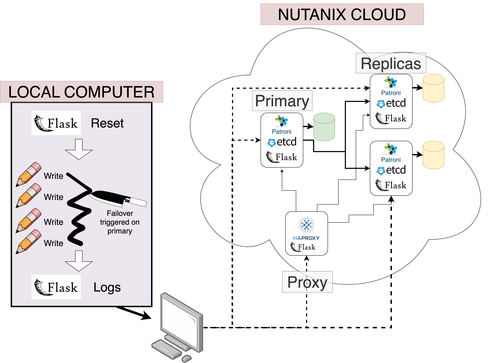

# Introduction

Modern users expect their apps and data to be accessible, _always_. Not just most of the time. Not just when there isn't maintence. __100% of the time__. That's what _highly available (HA)_ systems provide.

Okay, fine, true 100% uptime simply isn't possible. After all, the probability of a meteor destroying the planet tomorrow (and all your servers) is greater than 0%. But with thoughtful system design, we can get surprisingly close to that magic 100% guarantee.

In today's article, we'll explore how HA Databases are implemented in practice, with a special focus on understanding the mechanisms that allow HA databases to survive a handful of crashed nodes. By the end of this article, you'll understand what a _failover_ is, as well as see an example of latency breakdown in a real-world highly-available database using Postgres and Patroni. 

## State of the Art

Most modern systems implement high availability using a [_primary replica_](https://www.cs.cornell.edu/fbs/publications/DSbook.c8.pdf) model, where one node (the _primary_) processes all queries, and is responsible for sending these queries to the replicas. The replicas acknowledge receipt of the queries from the primary, and follow along with their own local copy of the database.

In the event that the primary goes down, some kind of [_consensus algorithm_](https://en.wikipedia.org/wiki/Consensus_(computer_science)) is used amongst the remaining replicas to decide who will become the next primary. A [_proxy_](https://en.wikipedia.org/wiki/Proxy_server) (or even proxies) is used to ensure that the from the client's perspective, it appears as though there is only a single, consistent node. (Although there may be a moment or two of downtime as a new primary is taking over.) Because each replica follows along with a local copy of the database, if/when they become primary, there is minimal lag before they are ready to accept new queries.    

State of the art systems have many additional optimizations to improve performance, including allowing read-only connections to replicas to reduce the load generated by reads on the primary, and tiering replicas to minimize the number of replicas the primary must communicate with.

## Failover

Regardless of the setup, all HA database systems have to deal with _failover_. Failover is the process where a replica (or collection of replicas) automatically detect the failure of the primary and promote a new primary. _Failover time_ is the amount of time, from the end-user's perspective, where the database cluster cannot accept new queries as this transition is happening. 

In today's article, we're going to dive deep into failover and hopefully answer the question:

> What are the steps that happen during failover in a modern HA system, and how much time do they each take?

# High Availability in Practice

## Setup and Environment

If you'd like to follow along yourself, you can follow the [detailed setup descriptions](https://github.com/mfpekala-nutanix/patroni-experiments/blob/main/docs/setup.md) from the associated project github. At a high level, here are the tools we're using:

- 4 VMs provided through [Nutanix Prism](https://www.nutanix.com/products/prism) running CentOS.
- [Postgres](https://www.postgresql.org/) as the underlying database.
- [Patroni](https://patroni.readthedocs.io/en/latest/) for templating and managing the Postgres nodes in the cluster.
- [HAProxy](https://www.haproxy.org/) to expose a single endpoint for DB connections even as the roles of the individual nodes change.
- [Flask](https://flask.palletsprojects.com/en/2.3.x/) to allow simple API-based communication through your local machine.

This setup is a simplified version of what is provided to you out of the box from the [Nutanix NDB](https://www.nutanix.dev/api_references/ndb/#/8girlyu0d2t1d-nutanix-ndb-api-v0-9) HA provisioning service.

Unfamiliar with any of the above? Don't worry, the setup is relatively simple, and you'll still be able to understand the important pieces of our highly available system.

## System Architecture

Before going any further, let's take a moment to understand how the nodes in our system are set up.

### Nutanix Cloud

We have a total of four nodes deployed in the Nutanix Cloud.

*** Database Nodes***

There are three databse nodes. One primary and two replicas. Each node is running three programs:

- _Patroni_ - You can think of Patroni as a Postgres manager. It creates a Postgres instance on each node, and handles Postgres configuration so that the replicas use Postgres's built in [write-ahead-log (WAL)](https://www.postgresql.org/docs/current/wal-intro.html) and replication features to follow updates from the primary. Patroni also exposes an API so that we can monitor the health of each DB instance.
- _Etcd_ - [Etcd](https://etcd.io/) is a distributed configuration store, which provides a reliable way for each node to read and update the state of the system. When a primary node goes down, and we need to elect a new primary, etcd ensures that everyone agrees on who the new primary is to avoid [split-brain](https://en.wikipedia.org/wiki/Split-brain_(computing)).
- _Flask_ - We use flask to expose a very simple API on each node that allows us to more easily control it for the sake of experimentation. Through the flask API, we can do things like restart Patorni/etcd, reset data, and scrape logs.

***Proxy Node***

We also run a proxy node. Like the database nodes, the proxy node has a simple Flask api to facilitate remote control and monitoring. In addition, it runs HAProxy to regularly poll the health of the database nodes, and make sure client requests always get routed to the current primary. This allows each client to interact with the system as if there was a single node.

### Local Computer

Our local computer uses API requests to communicate with the cloud nodes and orchestrate the experiment. It has two main threads:

- A writing thread - This thread simply connects to the proxy and attempts to write data to the database every second. 
- A failover thread - This thread triggers a failover in the primary after a certain amount of time, and then ends the experiment after a new primary is chosen and healthy.

## Experiment 

Our experiment is quite straightforward given the above setup. We simulate a business application generating data through our writing thread on our local computer. By manually triggering a failover, we are simulating what would happen in the case of some kind of crash in the primary node. Then, we monitor the system until it is healthy, and can reason about how much data was lost 

## Results

Be sure to add how the shutdown happens (from pctl logs)

Also add from the client's perspective (inserting at X rate, after dust settles there is Y data missing)

## Future Work

# Takeaways

