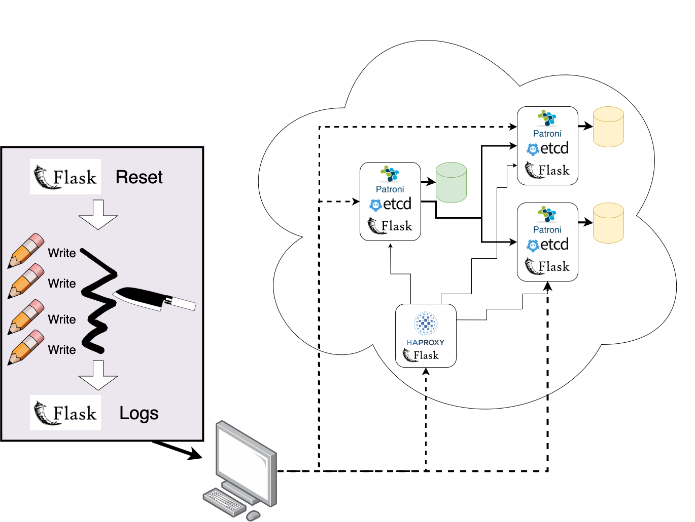

# Architecture

*The above diagram gives a high level overview of the major system components and how they interact.*

## Data Nodes

Data nodes are shown above in the top right. They are the 3 VMs which are connected to disks and responsible for maintaining the data given to the system. Each node individually runs:

- Patroni - For coordinating agreement/elections and order primary/backup
- etcd - For interacting with the distributed key/value store that patroni relies on to deliver results
- Flask - Exposes a simple API which allows easier remote control and log accumulation at the end of experiments

## HAProxy Node

There is a single node in the system that runs HAProxy. Note that all data that gets written from the client passes through this node, which handles routing to ensure that all data goes to the leader, who then leverages Patroni to handle replication.

Like the data nodes, the HAProxy node also exposes a bare-bones Flask API so that experiments can be started, stopped, cleaned up, etc. easily from a single machine.

## Experiment Runner (local computer)

Experiments are coordinated from your local machine. There are three pieces of the puzzle:

### Data Generator

This script simply establishes a connection to the DB through HA proxy and sends write requests at a regular interval. There are two main tunable knobs:

- *Frequency* - How often will the script write data. Given as a number of seconds (float) between requests (defaults to 0.2)
- *Rate* - How much data (MiB) should be written per second. Defaults to 10 MiB.

### Failover Manager

This is a simple helper class that abstracts away the logic of interacting with the Patroni API. It handles starting the cluster, making sure that we know who the first and next leader are (for looking at logs later), and issuing failovers. It also has logic that can block until the cluster is showing as up (from Patroni API) which is useful in coordination.

### Log Scraper

Once the experiment is over, this script communicates over the Flask API to gather logs from each of the nodes. It parses the logs into a consistent format so that we can view logs from different services (Patroni, etcd, HAProxy) in a uniform way.

## System Execution

The experiment works like this:

0. Turn on all of the VMs and run the Flask API as a background task.
1. The experiment runner connects to all of the VMs and makes sure necessary services are running (Patroni, etcd, HAProxy, ...)
2. The failover manager ensures that machine `pe1` is the first leader, so we know which logs to look at. (We also always issue failovers so that `pe2` is the second leader, for simplicity.)
3. The DataGenerator begins writing data.
4. A few seconds later, the FailoverManager issues a failover and blocks until Patroni reports back a new leader. During this time the DataGenerator is still attempting to write to the DB, but these requests are failing as it is unable to establish a valid write connection.
5. The DataGenerator continues to try to establish a valid write connection, once every tenth of a second. Once it does, it continues writing data for a few more seconds and then stops.
6. The experiment runner uses the Flask api to issue stop commands to all nodes.
7. Once the system is down, the LogScraper uses the Flask api to gather logs from each machine and parse them into a uniform format.
8. Results are plotted using `matplotlib` in a Python notebook.