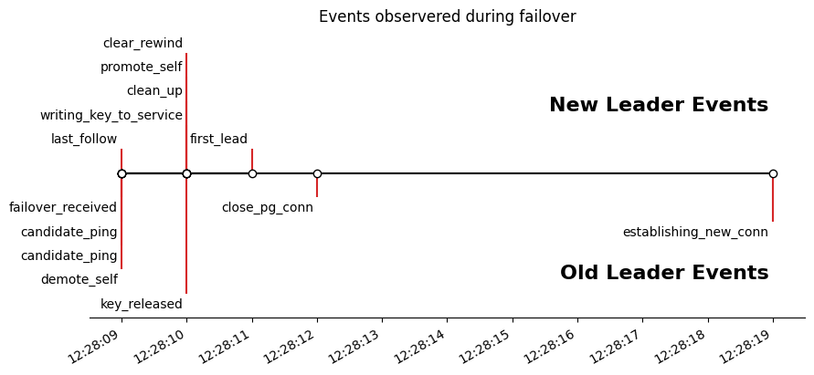

# Results

Events happen as follows:

- Leader receives failover request
- Leader pings the next leader _twice_ to make sure they are available and know about the failover.
- The leader releases the key and becomes the _old_ leader.
- The new leader picks up the key, promotes itself, and cleans logs/rewind state to reflect new leader status.
- The new leader issues first response on Patroni API that it is the leader.
- Meanwhile, the old leader resets its pg connection.
- There is a period of time when even though the new leader is in a valid leader state, it can only accept read-connections, and dissallows writes for an additional ~5-10 seconds.
    - More work is needed to scrape the pg logs to identify the precise events causing this delay.
